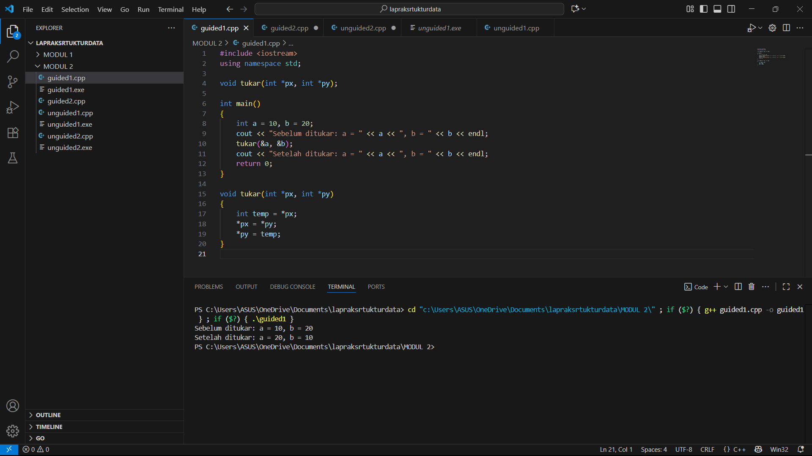

# M.AFRIZA-MARANTIKA-103112430271-MODUL-2
LAPRAK MODUL 2

# <h1 align="center">Laporan Praktikum Modul 2 <br> PENGENALAN BAHASA C++ (BAGIAN KEDUA) </h1>
<p align="center">M.AFRIZA MARANTIKA - 103112430271</p>

## Dasar Teori

Array adalah struktur data yang digunakan untuk menyimpan sekumpulan nilai dengan tipe data yang sama dalam satu variabel. Setiap nilai yang disimpan di dalam array disebut elemen array, dan masing-masing elemen dapat diakses menggunakan indeks.
## Guided
### soal 1 (call_by_pointer.cpp)
```c++
#include <iostream>
using namespace std;

void tukar(int *px, int *py); 

int main()
{
    int a = 10, b = 20;
    cout << "Sebelum ditukar: a = " << a << ", b = " << b << endl;
    tukar(&a, &b);
    cout << "Setelah ditukar: a = " << a << ", b = " << b << endl;
    return 0;
}

void tukar(int *px, int *py)
{
    int temp = *px;
    *px = *py;
    *py = temp;
}
```
Program ini menukar nilai dua variabel (a dan b) menggunakan parameter referensi (&).
Fungsi tukar() menerima dua variabel, lalu menukar nilainya dengan variabel sementara temp.


> Output
> 
### soal 2 (call_by_reference.cpp)
```c++
#include <iostream>
using namespace std;

void transposeMatriks(int m[3][3], int hasil[3][3]) {
    for (int i = 0; i < 3; i++) {
        for (int j = 0; j < 3; j++) {
            hasil[j][i] = m[i][j];
        }
    }
}

void tampilkanMatriks(int m[3][3]) {
    for (int i = 0; i < 3; i++) {
        for (int j = 0; j < 3; j++) {
            cout << m[i][j] << " ";
        }
        cout << endl;
    }
}

int main() {
    int matriks[3][3] = {
        {1, 2, 3},
        {4, 5, 6},
        {7, 8, 9}
    };
    int hasil[3][3];

    cout << "Matriks Awal:" << endl;
    tampilkanMatriks(matriks);

    transposeMatriks(matriks, hasil);

    cout << "\nMatriks Hasil Transpose:" << endl;
    tampilkanMatriks(hasil);

    return 0;
}
```
Kode di atas adalah program C++ yang menukar nilai dua variabel (a dan b) menggunakan parameter referensi

> Output
> 


## Unguided

### Soal 1

```c++
#include <iostream>
using namespace std;

void transposeMatriks(int m[3][3], int hasil[3][3]) {
    for (int i = 0; i < 3; i++) {
        for (int j = 0; j < 3; j++) {
            hasil[j][i] = m[i][j];
        }
    }
}

void tampilkanMatriks(int m[3][3]) {
    for (int i = 0; i < 3; i++) {
        for (int j = 0; j < 3; j++) {
            cout << m[i][j] << " ";
        }
        cout << endl;
    }
}

int main() {
    int matriks[3][3] = {
        {1, 2, 3},
        {4, 5, 6},
        {7, 8, 9}
    };
    int hasil[3][3];

    cout << "Matriks Awal:" << endl;
    tampilkanMatriks(matriks);

    transposeMatriks(matriks, hasil);

    cout << "\nMatriks Hasil Transpose:" << endl;
    tampilkanMatriks(hasil);

    return 0;
}
```
Program di atas adalah program C++ yang digunakan untuk menukar baris menjadi kolom pada sebuah matriks 3x3 (transpose).Matriks awal berisi angka 1 sampai 9. Fungsi transposeMatriks() menyalin isi matriks dengan posisi baris dan kolom ditukar (hasil[j][i] = m[i][j]). Fungsi tampilkanMatriks() menampilkan isi matriks ke layar. Program menampilkan matriks awal dan matriks hasil transpose.
       


> Output
> 


### Soal 2

```c++
#include <iostream>
using namespace std;


void kuadratkan(int &x) {
    x = x * x;
}

int main() {
    int angka = 5;
    
    cout << "Nilai awal: " << angka << endl;
    
    
    kuadratkan(angka);
    
    cout << "Nilai setelah dikuadratkan: " << angka << endl;
    
    return 0;
}
```
Program di atas adalah program C++ yang digunakan untuk mengkuadratkan nilai sebuah variabel menggunakan parameter referensi (&). Variabel angka diinisialisasi dengan nilai 5. Fungsi kuadratkan(int &x) menerima referensi dari variabel tersebut, lalu menghitung kuadratnya dengan operasi x = x * x. Karena menggunakan referensi, nilai asli dari variabel angka diubah langsung di memori.Hasilnya, nilai angka yang awalnya 5 menjadi 25 setelah pemanggilan fungsi.


> Output
> 


## Referensi

1. https://en.wikipedia.org/wiki/Data_structure
